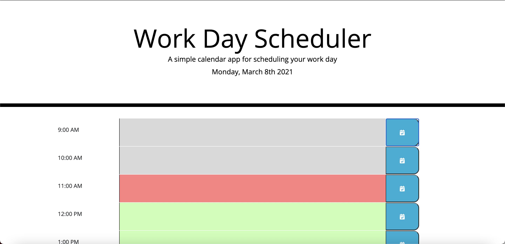
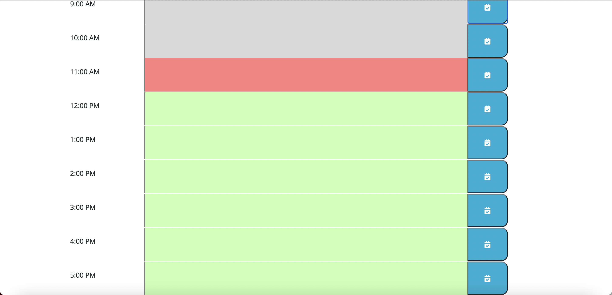

# Calendar-Scheduling-App

## Description

This calendar application shows the current date at the top of the page and nine timeslots, one for each hour in a 9-5 workday. The user can enter text into any timeslot and click a save button. The text is saved into local storage and will show at the corresponding time when the site is reloaded. The current hour is displayed with a red background, past hours are displayed in gray, and future hours are displayed green. 

## Images

## Application
https://kilaweeks.github.io/Work-Day-Scheduler

## Technologies

HTML
CSS
JavaScript
moment.js
